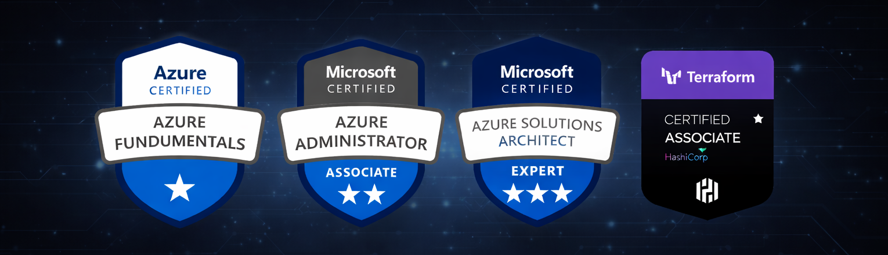

  

<h1 align="left">Hi 👋, I'm Adan Martinez</h1>

I’m passionate about technology, currently working on observability, Cloud, DevOps, Terraform, and more.

-   💻 I’m currently working as 
-   📝 I regularly write articles on 
-   💬 Ask me about Microsoft Azure, Terraform and DevOps 
-   🌱 Currently learning **DevOps, CI/CD, Terraform, Ansible and Observability**

  

<h3 align="left">Connect with me:</h3>

<h1 align="left"></h1>

